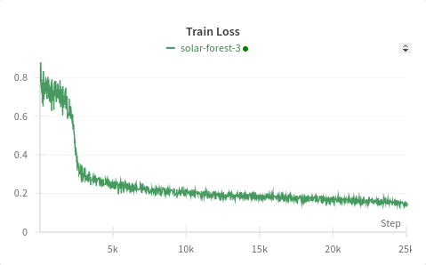
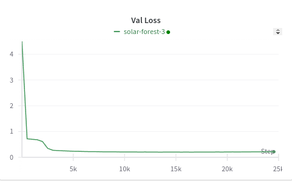

### Training Logs

### Greedy Sampling
Character Error Rate on Val Dataset: 0.02

Character Error Rate on Train Dataset: 0.0018

| Text                                                                                                                                                                                                                                              | Generated Text                                                                                                                                                                                                                          | CER    | Inference Time(*unoptimized)(s) |
| ------------------------------------------------------------------------------------------------------------------------------------------------------------------------------------------------------------------------------------------------- | --------------------------------------------------------------------------------------------------------------------------------------------------------------------------------------------------------------------------------------- | ------ | ------------------------------- |
| FROM THIS HE READ ME ONE OF THE DROLLEST CHAPTERS IN THE WORLD                                                                                                                                                                                    | FROM THIS HE READ ME ONE OF THE DROLLEST CHAPTERS IN THE WORLD                                                                                                                                                                          | 0.0    | 0.77                            |
| OR OF ITS THREE FIRST DUTCH GOVERNORS I HAVE HOWEVER GAINED MUCH VALUABLE AND CURIOUS MATTER FROM AN ELABORATE MANUSCRIPT WRITTEN                                                                                                                 | OR OF ITS THREE FIRST DUTCH GOVERNORS I HAVE HOWEVER GAINED MUCH VALUABLE AND CURIOUS MATTER FROM AN ELABORATE MANUSCRIPT WRITTEN                                                                                                       | 0.0    | 1.27                            |
| WHEN MISTER NEWBERRY AND MISTER DICK OVEREND WERE YOUNG MEN WENT INTO CONGRESS FROM PURE PATRIOTISM THERE WAS NO SUCH THING AS GRAFT OR CROOKEDNESS AS THEY BOTH ADMITTED IN THOSE DAYS AND AS FOR THE UNITED STATES SENATE                       | WHEN MISTER NEWBERRY AND MISTER DICK OVEREND WERE YOUNG MEN WENT INTO CONGRESS FROM PURE PATRIOTISM THERE WAS NO SUCH THING AS GRAFT OR CROOKEDNESS AS THEY BOTH ADMITTED IN THOSE DAYS AND AS FOR THE UNITED STATES SENATE             | 0.0    | 2.31                            |
| HE WOULD HAVE BORNE ON WITHOUT LEGS AT ALL RATHER THAN REMAIN UNDER THE ENEMY'S GAZE THE ENEMY LOFTILY CONTINUED THEIR WAY THEIR HEADS IN THE AIR AND SCORNING FURTHER NOTICE ALL SAVE YOUNG LORD VANE HE HOVERED ROUND THE RANKS OF THE UNWASHED | HE WOULD HAVE BORNE ON WITHOUT LEGS AT ALL RATHER THAN REMAIN UNDER THE ENEMY'S GAZE THE ENEMY LOFTILY CONTINUED THEIR WAY THEIR HEADS IN THE AIR AND SCORNING FURTHER NOTICE ALL SAVE YOUNG LORD VANE HE HOVERED RANKS OF THE UNWASHED | 0.0415 | 3.13                            |
| I WILL OF COURSE I WILL AND HE BEGAN THE PROCESS OF THINKING ABOUT IT IMMEDIATELY BEFORE THE DOOR WAS CLOSED BEHIND HER BUT WHAT WAS THERE TO THINK ABOUT NOTHING THAT SHE HAD SAID ALTERED IN THE LEAST HIS IDEA ABOUT THE MAN                   | I WILL OF COURSE I WILL AND HE BEGAN THE PROCESS OF THINKING ABOUT ITMEDIATELY BEFORE THE DOOR WAS CLOSED BEHIND HER BUT WHAT WAS THERE TO THINK ABOUT NOTHING THAT SHE HAD SAID ALTERED IN THE LEAST HIS IDEA ABOUT THE MAN            | 0.0315 | 2.477                           |
| LOOK THERE THE OLD FOXES HAVE COME BACK OUT OF FEAR FOR THEIR CUB'S SAFETY COME WE WILL SET IT FREE AND WITH THESE WORDS THEY UNTIED THE STRING ROUND THE CUB'S NECK AND TURNED ITS HEAD TOWARD THE SPOT WHERE THE OLD FOXES SAT                  | LOOK THERE THE OLD FOXES HAVE COME BACK OUT OF FEAR FOR THEIR CUB'S SAFETY COME WE WILL SET IT FREE AND WITH THESE WORDS THEY UNTIED THE STRING ROUND THE CUB'S NECK AND TURNED ITS HEAD TOWARD THE SPOT WHERE THE OLD FOXES SAT        | 0.00   | 2.56                            |
| AND SO DRAMATIC THE POOR DEVIL COULD NOT HAVE CHOSEN A WORSE MOMENT PEOPLE WON'T FORGET IT MABEL'S EYES SHONE WITH PLEASURE YOU POOR DEAR SHE SAID ARE YOU IN PAIN NOT MUCH BESIDES CHRIST                                                        | AND SO DRAMATIC THE POOR DEVIL COULD NOT HAVE CHOSEN A WORSE MOMENT PEOPLE WON'T FORGET IT MABEL'S EYES SHONE WITH PLEASURE YOU POOR DEAR SHE SAID ARE YOU IN PAIN NOT MUCH BESIDES CHRIST                                              | 0.00   | 2.15                            |
### Multinomial Sampling
Text: TELLING HIM IT WAS THE LIKENESS OF HER COUSIN RACHEL'S HUSBAND I REPLIED WE KNEW THAT GRANDFATHER HAD MARRIED A RACHEL SOMERS COUSIN CHARLES WAS SURPRISED AND A LITTLE VEXED THAT THE DOCTOR HAD NEVER TOLD HIM

Temperature scales the probability of the next token before sampling from the multinomial distribution. The most succulent setting seems to be 1.0

| Generated Text                                                                                                                                                                                                                                                                                                                                                                                                                                                                                                                                                                                                                                                                                                                                                                                                                                                                                                                                                                                                                                                                                                                                                                                                                                        | Temperature | CER                                               | Inference Time(* Unoptimized)(s) |
| ----------------------------------------------------------------------------------------------------------------------------------------------------------------------------------------------------------------------------------------------------------------------------------------------------------------------------------------------------------------------------------------------------------------------------------------------------------------------------------------------------------------------------------------------------------------------------------------------------------------------------------------------------------------------------------------------------------------------------------------------------------------------------------------------------------------------------------------------------------------------------------------------------------------------------------------------------------------------------------------------------------------------------------------------------------------------------------------------------------------------------------------------------------------------------------------------------------------------------------------------------- | ----------- | ------------------------------------------------- | -------------------------------- |
| TELLING HIM IT WAS THE LIKENESS OF HER COUSIN RACHEL'S HUSBAND I REPLIED WE KNEW THAT GRANDFATHER HAD MARRIED A RACHEL SOMERS COUSIN CHARLES WAS SURPRISED AND A LITTLE VEXED THAT THE DOCTOR HAD NEVER TOLD HAD NEVER TOLD HIM                                                                                                                                                                                                                                                                                                                                                                                                                                                                                                                                                                                                                                                                                                                                                                                                                                                                                                                                                                                                                       | 0.01        | 0.0721                                            | 3.819                            |
| TELLING HIM IT WAS THE LIKENESS OF HER COUSIN RACHEL'S HUSBAND I REPLIED WE KNEW THAT GRANDFATHER HAD MARRIED A RACHEL SOMERS COUSIN CHARLES WAS SURPRISED AND A LITTLE VEXED THAT THE DOCTOR HAD NEVER TOLD HAD NEVER TOLD HIM                                                                                                                                                                                                                                                                                                                                                                                                                                                                                                                                                                                                                                                                                                                                                                                                                                                                                                                                                                                                                       | 0.1         | 0.0721                                            | 3.78                             |
| TELLING HIM IT WAS THE LIKENESS OF HER COUSIN RACHEL'S HUSBAND I REPLIED WE KNEW THAT GRANDFATHER HAD MARRIED A RACHEL SOMERS COMERS COUSIN CHARLES WAS SURPRISED AND A LITTLE VEXED THAT THE DOCTOR HAD NEVER TOLD HIM                                                                                                                                                                                                                                                                                                                                                                                                                                                                                                                                                                                                                                                                                                                                                                                                                                                                                                                                                                                                                               | 0.5         | 0.0337                                            | 3.61                             |
| TELLING HIM IT WAS THE LIKENESS OF HER COUSIN RACHEL'S HUSBAND I REPLIED WE KNEW THAT GRANDFATHER HAD MARRIED A RACHEL SOMERS COUSIN CHARLES WAS SURPRISED AND A LITTLE VEXED THAT THE DOCTOR HAD NEVER TOLD HAD HIM                                                                                                                                                                                                                                                                                                                                                                                                                                                                                                                                                                                                                                                                                                                                                                                                                                                                                                                                                                                                                                  | 1           | 0.0192                                            | 3.63                             |
| [AUDIO:879][AUDIO:360][AUDIO:163]S[AUDIO:303]L[AUDIO:350][AUDIO:575]O[AUDIO:103]L[AUDIO:922][AUDIO:1034][AUDIO:994]Y[AUDIO:982][AUDIO:326][AUDIO:635][AUDIO:807][AUDIO:860][AUDIO:507][AUDIO:57][AUDIO:670]IT[AUDIO:701]A'H[AUDIO:301]H[AUDIO:702][AUDIO:434][AUDIO:313][AUDIO:195]W[AUDIO:752][AUDIO:685][AUDIO:755]                                                                                                                                                                                                                                                                                                                                                                                                                                                                                                                                                                                                                                                                                                                                                                                                                                                                                                                                 | 5           | Incorrect Text, Audio tokens leaks in text tokens | 0.729                            |
| [AUDIO:770][AUDIO:800]H[AUDIO:120]Z[AUDIO:527][AUDIO:250][AUDIO:707][AUDIO:259][AUDIO:296][AUDIO:96][AUDIO:571][AUDIO:1036][AUDIO:528]R[AUDIO:251][AUDIO:130][SOT][AUDIO:306][AUDIO:820][AUDIO:477][AUDIO:148][AUDIO:919][AUDIO:294][AUDIO:414][AUDIO:89][AUDIO:910][AUDIO:307][AUDIO:248][AUDIO:590][AUDIO:356][AUDIO:313]S[AUDIO:774][AUDIO:238][AUDIO:324][AUDIO:766][AUDIO:941][AUDIO:326][AUDIO:746][AUDIO:447][AUDIO:515][AUDIO:539][AUDIO:471][AUDIO:388]N[AUDIO:999][AUDIO:902][AUDIO:386][AUDIO:485] A[AUDIO:407][AUDIO:587][AUDIO:299][AUDIO:227][AUDIO:45][AUDIO:298][AUDIO:938][AUDIO:516][AUDIO:925][AUDIO:705][AUDIO:812][AUDIO:1041]W[AUDIO:127][AUDIO:489][AUDIO:1047][AUDIO:757][AUDIO:187][AUDIO:721][AUDIO:481][AUDIO:984][AUDIO:259][AUDIO:80][AUDIO:511][AUDIO:644][AUDIO:1020][AUDIO:646][AUDIO:83][AUDIO:831][AUDIO:1000][AUDIO:472][AUDIO:708]K[AUDIO:950][AUDIO:404][AUDIO:940]F[AUDIO:642][AUDIO:571]E[AUDIO:633][AUDIO:775][AUDIO:615][EOA][AUDIO:242]S[AUDIO:608][AUDIO:722]L[AUDIO:551][AUDIO:729][AUDIO:1008][AUDIO:187][AUDIO:838][AUDIO:861][AUDIO:271][AUDIO:375][AUDIO:72][AUDIO:336][AUDIO:994][AUDIO:854][AUDIO:544][AUDIO:349]G[AUDIO:125][EOA][AUDIO:210][AUDIO:364][AUDIO:77][AUDIO:220][AUDIO:838][AUDIO:927] | 10          | Incorrect Text, Audio tokens leaks in text tokens | 2.17                             |
| Does not generate [EOT] and keeps on creating audio tokens                                                                                                                                                                                                                                                                                                                                                                                                                                                                                                                                                                                                                                                                                                                                                                                                                                                                                                                                                                                                                                                                                                                                                                                            | 100         | Incorrect Text, Audio tokens leaks in text tokens | infinity                         |
