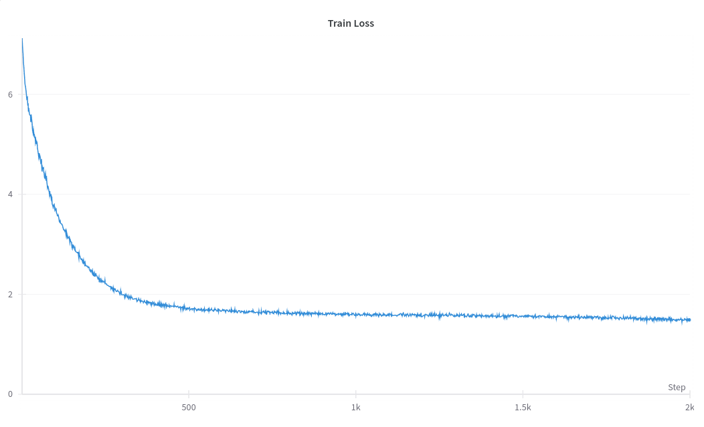
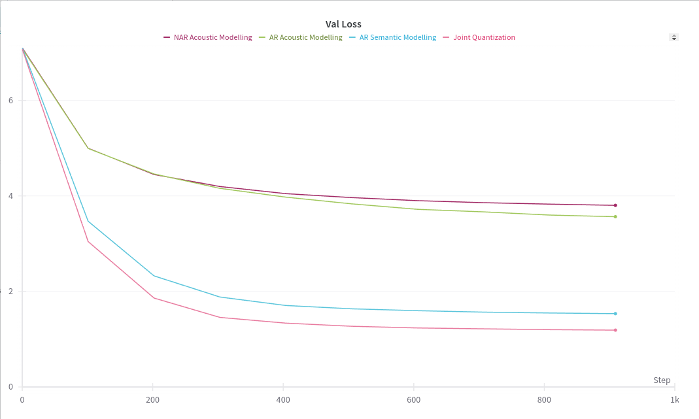

### To Do:
- [ ] Change the location of sampling of val data to the middle of the audio book
- [ ] Setup a learning rate scheduler
## Dataset Preparation
The dataset used for the experiments has been curated from a audio book of the novel [The girl who was taken](https://www.youtube.com/watch?v=8eez1QIKrp4). The original raw data was of 10 hrs 56 min with a sampling rate of 48KHz which had a total size of 1.6GB. The data was then preprocessed to a sampling rate of 24KHz and which reduced the size to 0.586 GB

## Quantization

The audio was initially quantized using [EnCodec](https://github.com/facebookresearch/encodec) with a bandwidth of 3kbps. A total of 4 codebooks were used to discreterize the audio data into tokens with each codebook having a vocab size size of 1024.
This step resulted in a dataset containing 11.7 Million audio tokens and a vocab size of 1024

Later during more experiments the Audio was quantized using Kmeans on encoder embeddings of Whipser which we call the semantic tokens similar to the tokenization procedure of [Audio LM](https://arxiv.org/pdf/2209.03143). The earlier [EnCodec](https://github.com/facebookresearch/encodec) tokens where then downsampled to 1.5kps and quantized using 2 codebooks to generate the acoustic tokens. The Language Models were then trained to predict the next semantic as well as acoustic tokens

Since the entire audio dataset is too large to be encoded all at once, it was divided into 21 parts of proportional size (~21 milllion samples each) and then quantized independently

This resulted in a total of 1.92 Million Audio Tokens for trianing out of which ~0.05% were considered for validation

### Training Procedure
A GPT style decoder only transformer has been used for training with no changes to the architecture except the initial and the last embeddings matrix weights were tied[1] and thus share the same parameters to save compute and fit the entire model while training in a single 16GB colab GPU

A constant learning rate of 1e-4 with AdamW optimizer was used and a drop out rate of 0.1[2] to improve underfitting

Appendix:

[1] - [Using the output embedding to improve language models](https://arxiv.org/pdf/1608.05859v3)

[2] - [Dropout Reduces Underfitting](https://arxiv.org/abs/2303.01500)
