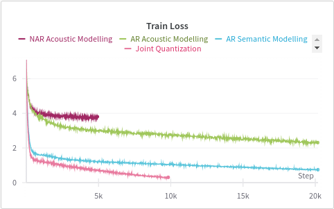

### To Do:
- [ ] Change the location of sampling of val data to the middle of the audio book
- [ ] Setup a learning rate scheduler
## Dataset Preparation
The dataset used for this experiments has been curated from a audio book of the novel [The girl who was taken](https://www.youtube.com/watch?v=8eez1QIKrp4). The original raw data was of 10 hrs 56 min with a sampling rate of 48KHz with a total size of 1.6GB. The data was then preprocessed to a sampling rate of 24KHz and quantized using [EnCodec](https://github.com/facebookresearch/encodec) with a bandwidth of 3kbps. A total of 4 codebooks were used to discreterize the audio data into tokens with a codebook size of 1024
This step resulted in a dataset containing 11.7 Million audio tokens with vocab size of 1024
### Training Procedure
A GPT style decoder only transformer has been used for training with no changes to the architecture except the initial and the last embeddings matrix share the same parameters to save compute and fit the entire model while training in a single 16GB colab GPU
A constant learning rate of 1e-3 with AdamW optimizer was used and a drop out rate of 0.2[1] to improve underfitting

## Quantization

| Quantization Rate | Audio Samples Quantized at different rates |
| ----------------- | ------------------------------------------ |
| 10 bits           | 

https://github.com/darshanmakwana412/audiolm/assets/96970161/021bdda5-7b90-467d-a286-e1525ca54379 

|
| 20 bits           | https://github.com/darshanmakwana412/audiolm/assets/96970161/d439a1d5-454d-4de1-8d54-328a1235db46 |
| 30 bits           | https://github.com/darshanmakwana412/audiolm/assets/96970161/8e7c9257-3062-413f-a74f-0d03b09c9ef5 |
| 40 bits           | https://github.com/darshanmakwana412/audiolm/assets/96970161/39ffa748-603e-4c8f-b1f0-8ca49537b83b |

#### Speech Tokenizer
Speech Tokenizer[2] proposes a unified semantic and acoustic tokenization procedure.
It uses [EnCodec](https://github.com/facebookresearch/encodec) for acoustic tokens 
Since the entire audio dataset is too large to be encoded all the once, it was divided into 21 parts of proportional size (~21 milllion samples each)
The entire dataset was
Audio Modelling using only Semantic Tokens
A total of 1.92 Million Semantic Tokens were considered

| Train Loss                           | Val Loss                             |
| ------------------------------------ | ------------------------------------ |
|  |  |

After training for 2000 steps the model achieves a loss of 1.445 from 7.1224 and still decreasing, it seems to converge at 1.226 if trained for more 2000 steps

| Steps | Audio Logs Sampled randomly from the Val Dataset | Train Loss | Val Loss |
| ----- | ------------------------------------------------ | ---------- | -------- |
| 0     | ![[step_0.mp3]]                                  | 7.125      | 7.124    |
| 200   | ![[step_200.mp3]]                                | 2.546      | 2.301    |
| 400   | ![[step_400.mp3]]                                | 1.808      | 1.695    |
| 600   | ![[step_600.mp3]]                                | 1.697      | 1.601    |
| 800   | ![[step_800.mp3]]                                | 1.623      | 1.556    |
| 1000  | ![[step_1000.mp3]]                               | 1.577      | 1.536    |
| 1200  | ![[step_1200.mp3]]                               | 1.549      | 1.518    |
| 1400  | ![[step_1400.mp3]]                               | 1.542      | 1.507    |
| 1600  | ![[step_1600 1.mp3]]                             | 1.562      | 1.487    |
| 1800  | ![[step_1800 1.mp3]]                             | 1.497      | 1.464    |
| 2000  | ![[step_2000 1.mp3]]                             | 1.465      | 1.43     |
Notes:
- After around 2K steps the model seems to generate words and pauses but not yet understandable english ( except some common words and phrases )
- The robotic voice is not an artifact of training but a result of very low quantization which takes less time and compute because as I just wanted to do a dry run on audio tokens
- Another peculiar thing is to notice is that val loss is always lesser than the training loss, a possible reason might be the size (val data is only 0.05% of the entire data) and the location from where it is taken, as I am only taking last few (0.05 * 10.52 * 60) ~ 30mins of the audio book which. I will fix this in the next model run

Appendix:
[1] - [Dropout Reduces Underfitting](https://arxiv.org/abs/2303.01500)
